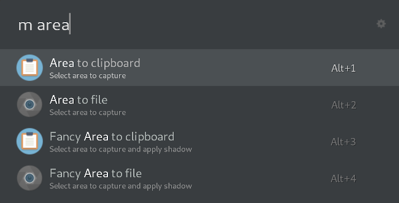

# ulauncher-maim

📷 [Ulauncher](https://ulauncher.io) extension for quick [maim](https://github.com/naelstrof/maim) screenshots.

Call quick commands for three basic modes: Area, Window and Fullscreen.
Each of the modes can be saved to either clipboard or file.
Each of these can be saved with or without "Fancy", which adds a shadow to the output image (requires [ImageMagick](https://imagemagick.org/)'s `convert`).

## Requirements

- `xclip` required for saving to clipboard
- `xdotool` required for window selection
- `convert` (ImageMagick) required for fancy shadows

Some icons from the [Numix project](https://github.com/numixproject) and [Wikipedia](https://commons.wikimedia.org/wiki/User:CFCF/Flat%27n%27round).

